# 槐柏镇出发 · 陕北 + 宁夏 自然景观自驾环线（5 天）

> **适用**：洛川县槐柏镇出发 / 自驾 / **10 月秋季**（其他季节需自行调整光线时段）/ 偏好纯自然景观
> **总里程**：约 **1817 km** / 5 天
> **车程口径**：**表中车程为实测值**（按百度地图实际导航时长，比理论路网规划略长）
> **每个景点按 4 小时量安排**，沙坡头单独占一整天

---

## 一、路线总览

```
D1 槐柏镇     ──2h──> 壶口瀑布      ──2.5h──> 乾坤湾        ──1h──> 延川县城
   07:00 出发         3h · 黄河的水           2h · 黄河的弯         宿

D2 延川县城   ──3h──> 靖边波浪谷    ──2.5h──> 哈巴湖        ──0.5h──> 盐池县城
   07:00 出发         4h · 丹霞纹理           1h · 荒漠夕阳           宿

D3 盐池县城   ──2.7h──> 沙坡头          ──50min──> 66号公路   ──1h──> 中卫城区
   07:00 出发           6h · 沙漠撞黄河            20min 打卡         宿

D4 中卫城区   ──2h──> 海原县城 ──0.5h──> 南华山          ──3h──> 平凉城区
   09:00 出发         午餐               0.5h · 山地秋色         宿

D5 平凉城区   ──0.5h──> 崆峒山    ──5.5h──> 槐柏镇
   06:15 出发           5h · 云海           到家 19:00
```

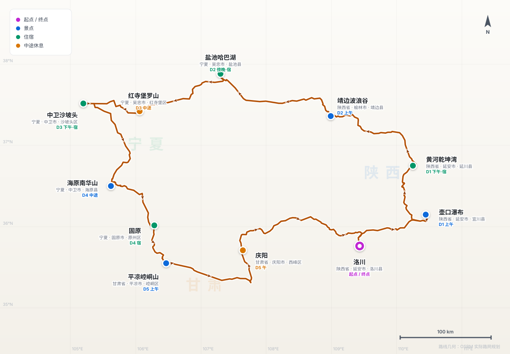

<sub>全程约 1817 km · 路线几何为 OSRM 实际路网规划结果 · 里程为路网实测，车程为百度地图实测导航时长 · 底图为示意，不用于导航</sub>

**景观主线**：黄河的水 → 黄河的弯 → 丹霞的纹 → 荒漠的湖 → 沙漠撞黄河 → 山地的秋。六段景观类型互不重复，一路向西北推进再从南边折回，**全程不走回头路**。

| 日 | 主要景点（游览时长） | 驾驶 | 住 |
|---|---|---|---|
| **D1** | 壶口瀑布 3h + 黄河乾坤湾 2h（下午金光） | 5.5 h | 延川县城 |
| **D2** | 靖边波浪谷 4h + 盐池哈巴湖 1h（傍晚） | 6 h | 盐池县城 |
| **D3** | **沙坡头 6h（整天）** + 中卫 66 号公路 20min | 4.5 h | 中卫城区 |
| **D4** | 海原南华山 0.5h（秋景） | 5.5 h | 平凉城区 |
| **D5** | 崆峒山 5h（景交 + 游玩），返程 | 6 h | 到家 |

**三个要点**——照着走就行，细节在各日说明里：

- **行程是围着光线排的**。波浪谷的一线天只在 10:00-12:00 成立、乾坤湾非下午侧光不可、哈巴湖和 66 号公路都要傍晚，所以 **D1、D2、D3、D5 都是 7:00 出发**，只有 D4 可以睡到 9 点。
- **两段超 2.5 h，都在后半程**：D4 南华山→平凉 3 h、D5 平凉→家 5.5 h。这两段中途都要主动停一次活动腿脚，见各日说明。
- **D5 早 7:00 是"到崆峒山门口"的时间**——平凉城区到景区还有 29 km / 0.5 h，**得 6:15 出门**。

---

## 二、逐日行程

### Day 1｜槐柏镇 → 壶口瀑布 → 黄河乾坤湾 → 延川县城（321 km）· 黄河双景

**7:00 出发。** 两个景点都是下午光线最好，同天走只能给一个——这天把最佳光线让给乾坤湾。

| 时段 | 安排 | 车程 |
|---|---|---|
| **07:00** | 槐柏镇出发 | **2 h** |
| 09:00-12:00 | **壶口瀑布**（3 h，含龙洞） | |
| 12:00-13:00 | 午餐休息 · **宜川县壶口镇**（景区旁，9 km） | |
| 13:00-15:30 | 车行至乾坤湾 | **2.5 h** |
| **15:30-17:30** | **乾坤湾**（2 h，登高拍照）——大拐弯的黄金光线窗口 | |
| 17:30-18:30 | 车行至延川县城 | **1 h** |
| **19:00** | 延川县城 · 晚餐住宿 | |

#### 上午：壶口瀑布（3 h）

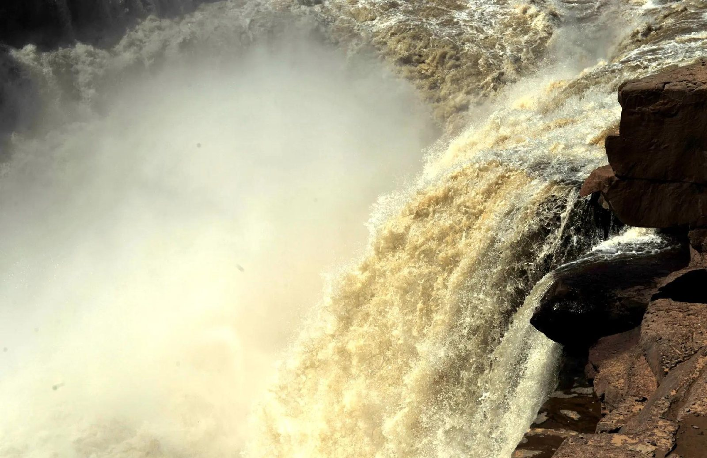

壶口是黄河唯一的大瀑布。宽阔河面在这里被骤然收进几十米石槽——看的不是落差，是**整条黄河被挤进一个壶口**的那股力量。

**让出下午光线不影响它**：壶口的看点是水量和气势，上午一样震撼；**水雾彩虹上午也有**，只要出太阳。

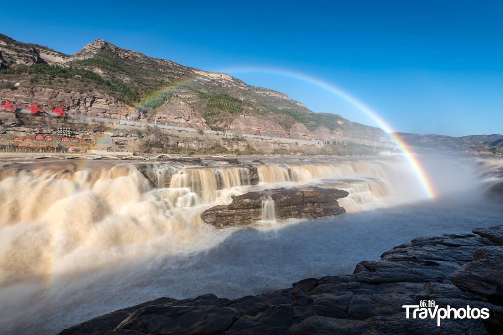

<sub>↑ 这不是等来的运气——9-11 月的壶口，阳光角度配上瀑布水雾，出彩虹是常态。</sub>

- **分陕西侧和山西侧，门票不通用**。从洛川来走**陕西侧**，视野开阔适合全景，**无需两岸往返**。
- **水雾极大**，必带雨衣或防水外套，穿防滑鞋；相机注意防水。
- 国庆旺季**建议提前 1-3 天公众号预约**，会限流。
- 别错过**龙洞**——从侧下方仰视瀑布的通道，视角和观瀑台完全不同。3 h 的安排足够走完观瀑台 + 龙洞。

#### 午餐：宜川县壶口镇

壶口镇就在景区旁 9 km，是这一段唯一的落脚点。吃**宜川手工挂面、壶口酥饺**，休整 1 h 再上路。

#### 下午：黄河乾坤湾（2 h）

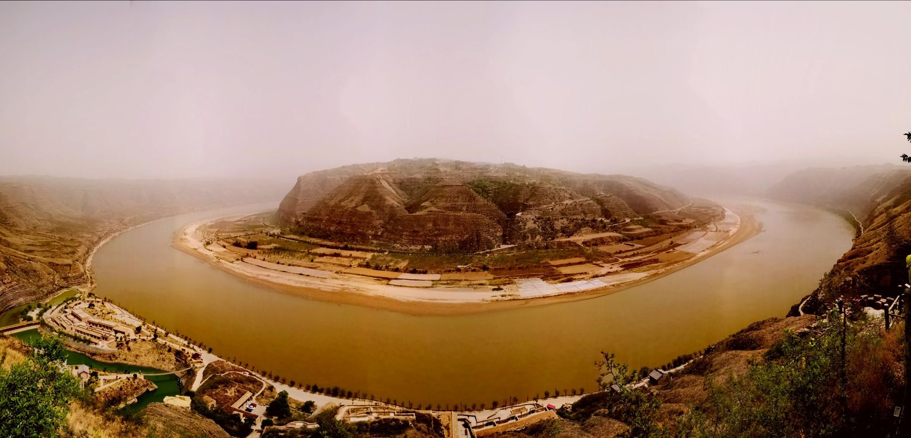

黄河在这里拐出一个近 **320° 的大弯**，是整条黄河最著名的曲流。上午看的是黄河的"力"，下午看的是黄河的"形"——同一条河，两种完全不同的震撼。

**中间这段路本身就是风景**：走**沿黄观光公路**北上，一路贴着秦晋大峡谷，比高速慢但值得。

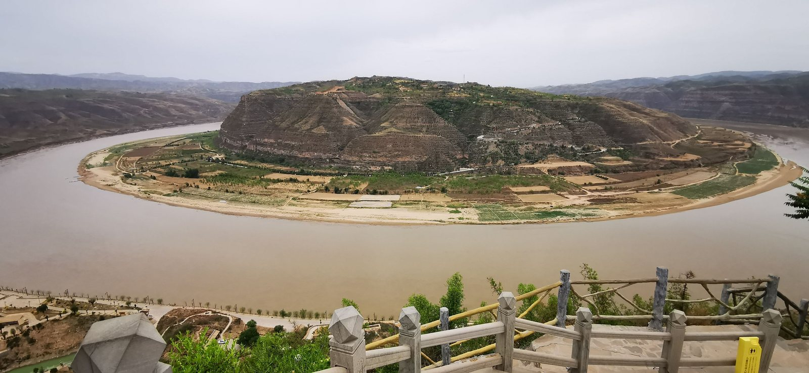

- **15:30-17:30 正好是拍大拐弯的最佳光线，这是今天早起的全部理由**。上午顶光下河湾发白、层次全无；只有下午侧光才能拉出沟壑的立体感。
- **2 h 是"登高拍照"的量**：直接上主观景台（乾坤湾、清水湾两处），**买观光车票**代步，不徒步下切河谷。
- 观景台在崖边，**风大**，注意安全和帽子。

**住**：延川县城（陕西省 · 延安市 · 延川县）。从乾坤湾 24 km / 1 h。县城餐饮住宿齐全，比景区旁民宿方便；吃**延川红枣、陕北碗托、洋芋擦擦**。

---

### Day 2｜延川县城 → 靖边波浪谷 → 盐池哈巴湖 → 盐池县城（398 km）· 丹霞 + 荒漠湖

**7:00 出发。** 今天是全程驾驶最重的一天（6 h），两个景点一早一晚，中间全在路上。

| 时段 | 安排 | 车程 |
|---|---|---|
| **07:00** | 延川县城出发 | **3 h** |
| **10:00-14:00** | **靖边波浪谷**（4 h）——一线天 / 丹霞 / 火星地貌 / 玻璃栈道 | |
| 14:00-15:00 | 午餐休息 · **靖边县龙洲镇**（景区所在镇） | |
| 15:00-17:30 | 车行至哈巴湖 | **2.5 h** |
| **17:30-18:30** | **哈巴湖**（1 h）——夕阳 / 胡杨 / 湖边 | |
| 18:30-19:00 | 车行至盐池县城 | **0.5 h** |
| **19:00** | 盐池县城 · 晚餐住宿 | |

#### 上午：靖边波浪谷（龙洲丹霞，4 h）

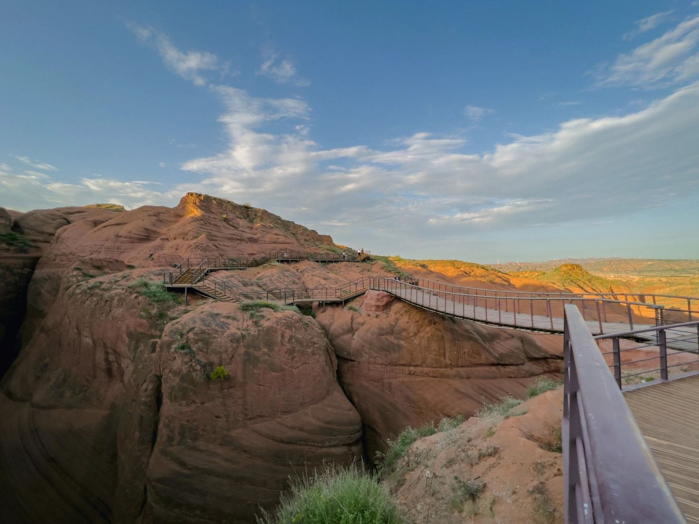

层层叠叠的红砂岩纹理如凝固的波浪，国内最好的红砂岩丹霞地貌。

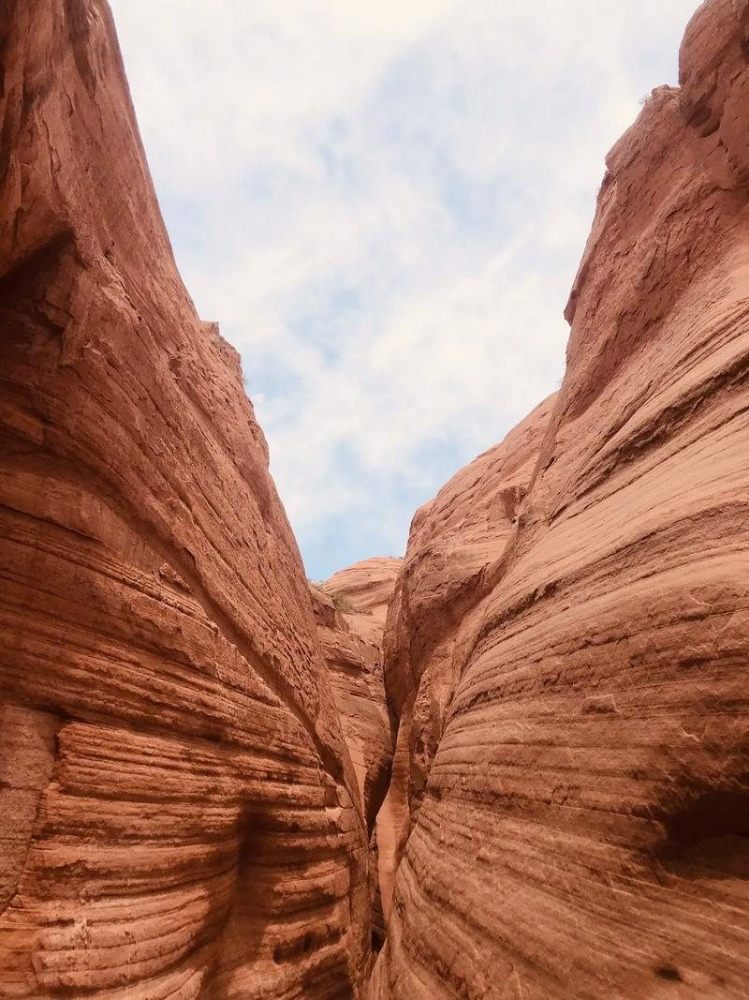

**10:00 到正好卡住一线天的窗口**：一线天需要阳光从狭窄谷顶垂直射入谷底，**10:00-12:00 是它一天中唯一的窗口**，光影对比最强。4 h 的量足够把几个片区都走一遍：

| 片区 | 看点 | 建议时段 |
|---|---|---|
| **地心丹霞** | **一线天**（垂直光柱） | **10:00-12:00 优先** |
| **火星地貌区** | 沟壑纵横的赭红台地，像另一颗星球 | 12:00-13:00 |
| **玻璃栈道** | 悬崖凌空段，俯视丹霞纹理 | 13:00-14:00 |
| 赤壁丹霞 | 大面积红岩崖壁 | 时间富余再加 |

**要点**
- 门票约 90 元（淡季可能降至 60 元）；**区间车约 30 元且必乘**——三个片区彼此很远，走不过去。
- **必须带干粮和水进景区**：片区之间无餐饮，4 h 全程在户外，午饭要等出景区到龙洲镇才吃。
- **玻璃栈道**需另买鞋套，怕高者可绕行常规栈道。
- **穿浅色衣服**（白、黄、蓝）；红衣服会融进红岩背景。
- **别信路边"免费野波浪谷"的带路**。很多是封闭保护区，有安全隐患，也可能被劝返，走正规入口。
- 丹霞岩层脆弱，务必走栈道；砂岩路面，防滑鞋。

<sub>火焰丹霞是日落景（18:00 前后），今天 14:00 就要走，看不到——想要的话得在龙洲镇多住一晚。</sub>

#### 午餐：靖边县龙洲镇

波浪谷就在龙洲镇域内，出景区即到镇上。吃**靖边荞面饸饷、羊肉剁荞面**，休整 1 h。

#### 傍晚：盐池 · 哈巴湖（1 h）

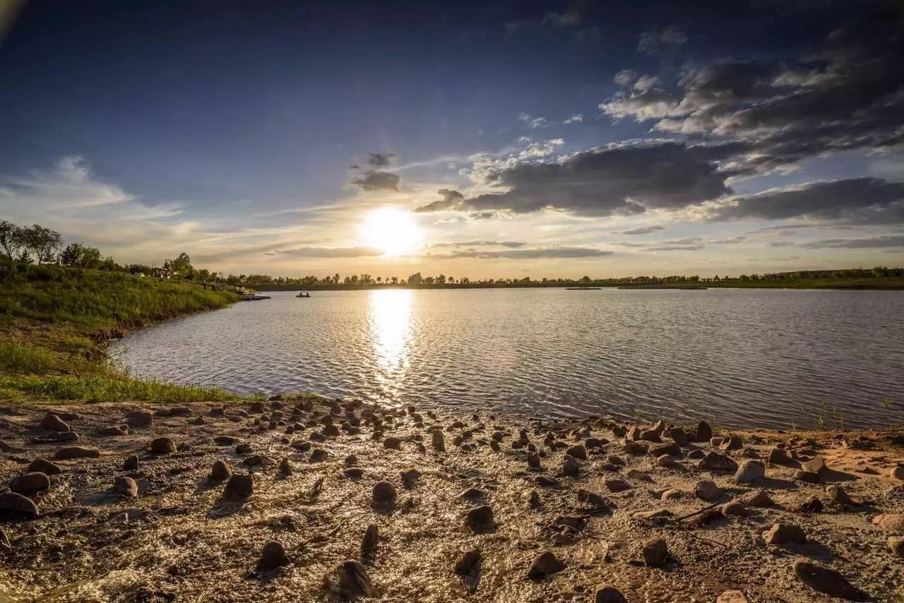

沙漠治理后形成的**湿地湖泊 + 沙丘 + 人工林**共生地貌。看点不是湖有多大，而是**"沙海绿洲"的强烈对比**——连绵沙丘紧挨着郁郁葱葱的林木和水面。

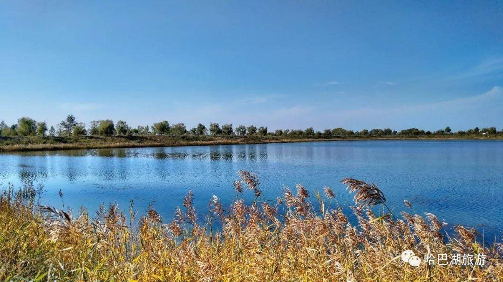

**要点**
- **自驾进景区约 300 元/车**（含门票及露营位）。景区面积很大、景点分散，**开车进去是唯一实际的游览方式**——1 h 的安排正是建立在车能开到湖边的前提上。
- **17:30 到，正好吃住傍晚黄金光**：夕阳 + 湖面倒影 + 秋季变黄的胡杨，1 h 拍完精华。正午强光最差。
- 秋季景区内**胡杨林会变黄**，是这一站的主角。
- 晚餐吃**盐池滩羊**，这是宁夏最有名的羊肉产地。

**住**：盐池县城（宁夏 · 吴忠市 · 盐池县）。从哈巴湖 18 km / 0.5 h。

---

### Day 3｜盐池县城 → 沙坡头（整天）→ 中卫 66 号公路 → 中卫城区（295 km）· 沙漠撞黄河

**7:00 出发。** 今天只有一个大景，但要给它一整天——沙坡头是全程唯一值得泡满 6 小时的地方。

| 时段 | 安排 | 车程 |
|---|---|---|
| **07:00** | 盐池县城出发 | **2.7 h** |
| **09:45-17:00** | **沙坡头**（约 6 h，中午出景区吃饭） | |
| 17:00-17:50 | 车行至 66 号公路 | **50 min** |
| **17:50-18:10** | **中卫 66 号公路**（20 min 拍照打卡） | |
| 18:10-19:10 | 车行至中卫城区 | **1 h** |
| **19:10** | 中卫城区 · 晚餐住宿 | |

#### 全天：沙坡头（6 h）

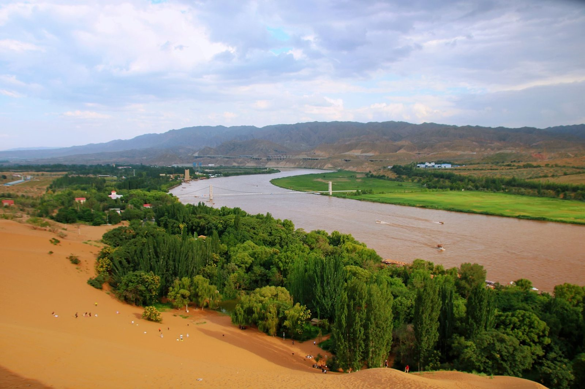

沙坡头的独特不在"沙漠"本身，而在**腾格里沙漠边缘和黄河直接撞在一起**——一侧连绵沙丘，一侧绿洲河水，这种反差国内几乎找不到第二处。这是全程唯一给整天的景点。

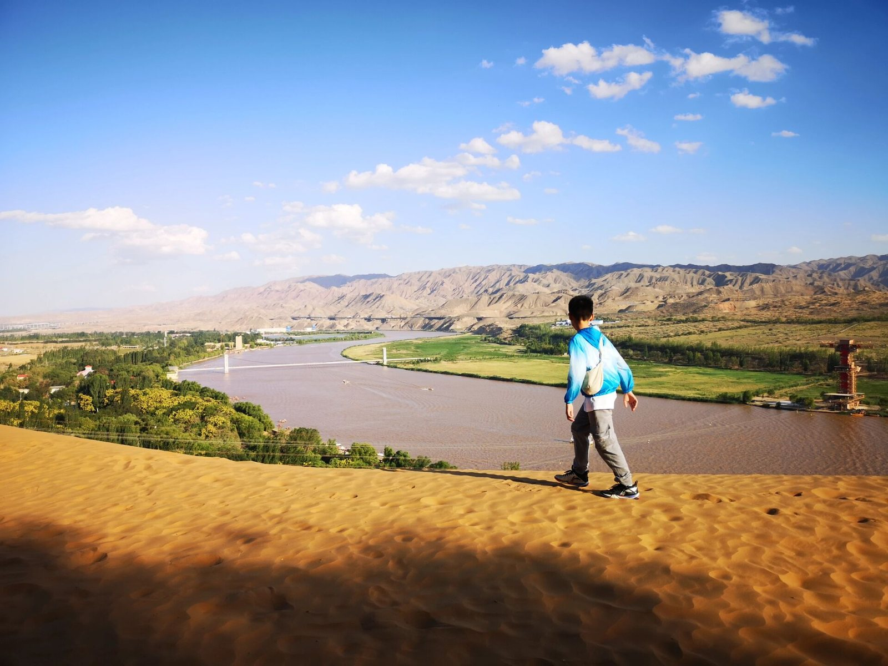

**6 小时怎么分**

| 时段 | 安排 |
|---|---|
| 09:45-12:30 | **沙漠区**：滑沙、骆驼、沙海冲浪、登沙坡看大漠全景 |
| 12:30-13:30 | 午餐——**出景区到迎水桥镇或中卫市区**吃 |
| 13:30-17:00 | **黄河区**：黄河飞索、羊皮筏子、水车、河岸绿洲，下午光线拍沙河交界最好 |

**要点**
- 分**沙漠区**和**黄河区**两侧，都要走到才算看全，这也是要给一整天的原因。
- **午餐出景区吃**：景区内餐饮贵且选择少，**迎水桥镇**就在景区门口，中卫市区略远但更好；出入景区记得**留好票根/手环**。
- **门票只含首道大门**；滑沙、骆驼、黄河飞索、羊皮筏子等另收，按兴趣**挑套票更划算**——玩满一天的话套票几乎必买。
- 国庆**必须提前预约**，会限流。
- 沙漠区上午光线好、人少；**下午留给黄河区**，侧光拍沙漠与河水的交界最出片。
- 沙子细，**防沙鞋套 + 魔术头巾**必备；相机注意进沙。

#### 傍晚：中卫 66 号公路（20 min）

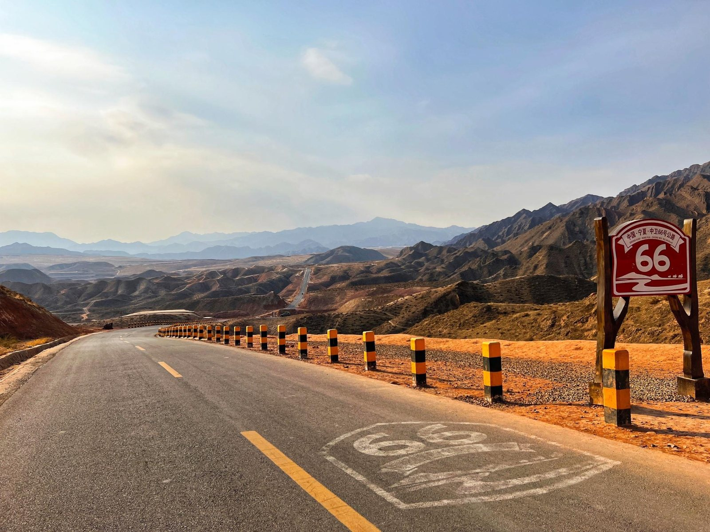

这条通往北长滩的乡村公路，起伏地势配两侧荒凉戈壁，是公路片的经典机位。**免费，全天开放**，从沙坡头 50 min 车程。

- **20 min 就够**——停车、拍几张、走人。日落前的斜光最好，17:50 到正合适。
- **拍照请停观景台**，别站在路中间——路窄且有车。
- 再往里就是北长滩村（还有 20 km 土路），今天不进去。

**住**：中卫城区（宁夏 · 中卫市 · 沙坡头区）。从 66 号公路 30 km / 1 h。晚餐吃**中卫蒿子面、羊杂碎、硒砂瓜**。

---

### Day 4｜中卫城区 → 海原南华山 → 平凉城区（389 km）· 山地秋色

**今天可以睡到 9 点出发**——全程唯一不用早起的一天。但驾驶 5.5 h，且下午有一段 3 h 长途。

| 时段 | 安排 | 车程 |
|---|---|---|
| **09:00** | 中卫城区出发 | **2 h** |
| **12:00-13:00** | 午餐休息 · **海原县城** | |
| 13:00-13:30 | 车行至南华山 | **0.5 h** |
| **13:30-14:00** | **南华山**（0.5 h，带地垫赏秋景） | |
| 14:00-17:00 | 车行至平凉 | **3 h** ⚠ |
| **17:00** | 平凉城区 · 晚餐住宿 | |

#### 午餐：海原县城（宁夏 · 中卫市 · 海原县）

从中卫城区 159 km / 2 h。海原是这一天唯一的补给点，**吃饭、加油、买水都在这里办**——南华山上没有任何设施。吃**海原羊羔肉、燕面揉揉、荞面搅团**。

#### 午后：海原 · 南华山（0.5 h）

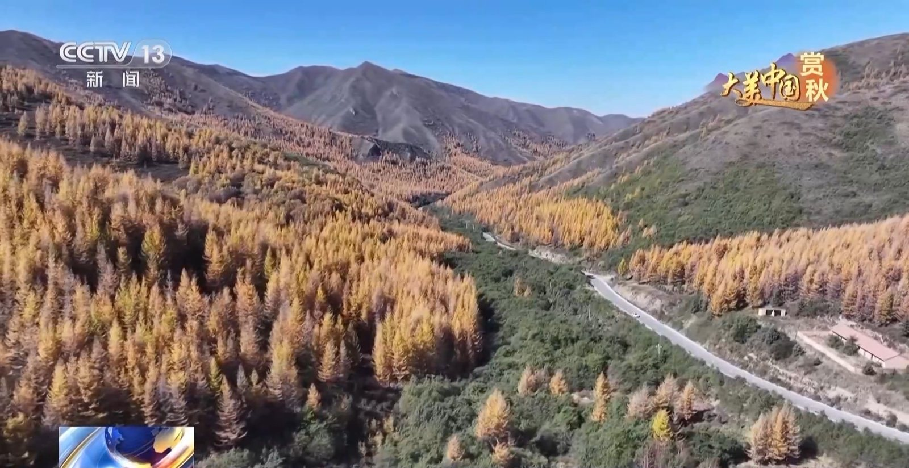

南华山是六盘山余脉，海拔较高、植被丰富。**10 月这里层林尽染，落叶松金黄**，是全程第一处森林景观，和前三天的干旱地貌形成最大反差。

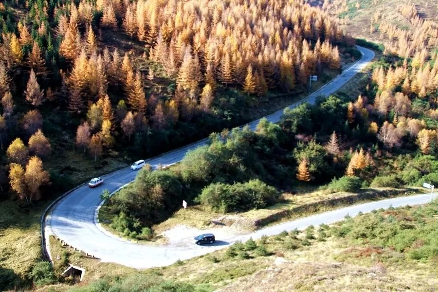

**要点**
- **只停 0.5 h，就是"铺地垫坐下来看秋景"**：车开到山道边视野好的位置，铺垫子、拍照、喝口水，不进深度徒步线。
- **山上没有餐饮设施**，水和干粮在海原县城备好。
- 山顶气温比县城低，**秋季早晚温差大**，冲锋衣必带。
- 顺路可看海原大地震博物馆（1920 年海原大地震遗迹），时间富余再说。

#### 下午：南华山 → 平凉（213 km / 3 h）⚠

**这是全程第二长的一段。** 山区路弯道多，14:00 出发、17:00 到，天黑前能到。

**中途在固原附近服务区停一次**（约过半处），下车走 10 分钟。这一段没有值得专门停的景点，纯赶路——所以宁可把休息安排明确些。

**住**：平凉城区（甘肃省 · 平凉市 · 崆峒区）。晚餐吃**平凉暖锅、静宁烧鸡、羊肉泡**。**今晚早睡**——明天 6:15 就要出门。

---

### Day 5｜平凉崆峒山 → 槐柏镇（414 km）· 山地丹霞 + 返程

**6:15 从平凉城区出门**（到崆峒山还有 29 km / 0.5 h），**7:00 进山**。今天驾驶 6 h，是返程日。

| 时段 | 安排 | 车程 |
|---|---|---|
| 06:15 | 平凉城区出发 | 0.5 h |
| **07:00-12:00** | **崆峒山**（5 h，景交 + 游玩） | |
| 12:00-13:00 | 午餐休息 | |
| 13:00-18:30 | 车行返程 | **5.5 h** ⚠ |
| **19:00** | 到家 | |

#### 上午：平凉 · 崆峒山（5 h）

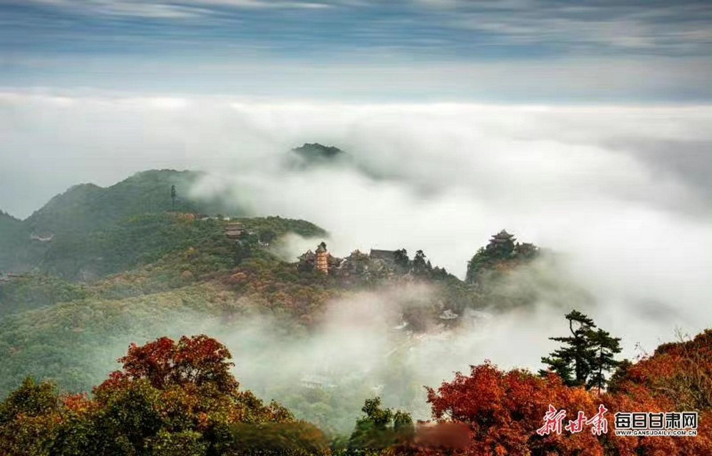

**10 月是崆峒山一年中最美的时候**。丹霞地貌的岩壁配上变色的辽东栎和枫树，浅红、绯红、深红交织；**秋季雨后常出云海**，古刹飞檐在云雾中若隐若现——**7:00 进山正是云海概率最高、人最少的时候**。

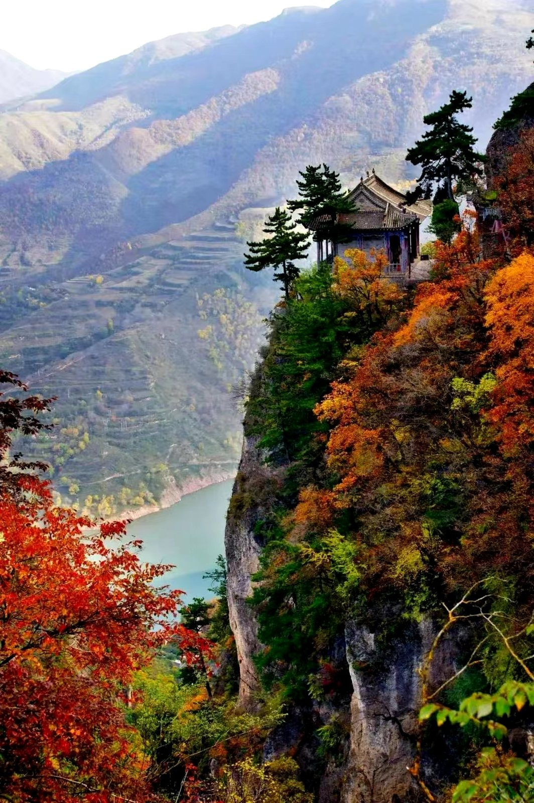

**要点**
- 旺季门票（4/1-10/31）约 **110 元/人**；**景区环保车 + 索道另收，这就是"景交"的部分**——5 h 的安排是建立在坐车+索道上山的前提上。
- **路线**：环保车到中台 → 索道上山 → 步行游核心区（中台、皇城、天梯）→ 下行。5 h 能走完精华且不赶。
- 山势较高，10 月早晚气温低，**带保暖外套**；穿登山鞋。
- **12:00 必须下山**——下午还有 5.5 h 车程。

#### 下午：返程 5.5 h ⚠

**这是全程最长的一段，385 km。**

- **中途必须停 1-2 次**，每次 15 分钟以上。建议在**庆阳（西峰）**一带停第一次（约过半），下车活动腿脚、加油。
- 13:00 出发、18:30 到，**基本全程日光**，只有最后一小段可能天黑。
- 山区路段 10 月可能有雾，出发前看天气。
- 若当天状态不好，就在**庆阳住一晚**，次日上午再回家——这段拆成 2.5 h + 3 h 会轻松很多。

---

## 三、车程总表

**车程为百度地图实测导航时长；里程为 OSRM 路网实测。**

| 日 | 路段 | 里程 | 车程 |
|---|---|---|---|
| **D1** | 槐柏镇 → 壶口瀑布 | 162 km | **2 h** |
| **D1** | 壶口瀑布 → 宜川县壶口镇（午餐） | 9 km | 10 min |
| **D1** | 壶口镇 → 黄河乾坤湾 | 126 km | **2.5 h** |
| **D1** | 乾坤湾 → 延川县城（宿） | 24 km | **1 h** |
| **D2** | 延川县城 → 靖边波浪谷 | 157 km | **3 h** |
| **D2** | 波浪谷 → 靖边县龙洲镇（午餐） | 30 km | 含游览 |
| **D2** | 龙洲镇 → 盐池哈巴湖 | 193 km | **2.5 h** |
| **D2** | 哈巴湖 → 盐池县城（宿） | 18 km | **0.5 h** |
| **D3** | 盐池县城 → 沙坡头 | 239 km | **2.7 h** |
| **D3** | 沙坡头 → 中卫 66 号公路 | 26 km | **50 min** |
| **D3** | 66 号公路 → 中卫城区（宿） | 30 km | **1 h** |
| **D4** | 中卫城区 → 海原县城（午餐） | 159 km | **2 h** |
| **D4** | 海原县城 → 南华山 | 17 km | **0.5 h** |
| **D4** | 南华山 → 平凉城区（宿） | 213 km | **3 h** ⚠ |
| **D5** | 平凉城区 → 崆峒山 | 29 km | **0.5 h** |
| **D5** | 崆峒山 → 槐柏镇（到家） | 385 km | **5.5 h** ⚠ |
| | **合计** | **约 1817 km** | **约 27.7 h** |

**单日驾驶总时长**

| 日 | 驾驶合计 | 游览合计 | 出发 | 到达 |
|---|---|---|---|---|
| D1 | 5.5 h | 5 h（壶口 3 + 乾坤湾 2） | 07:00 | 19:00 |
| D2 | **6 h** | 5 h（波浪谷 4 + 哈巴湖 1） | 07:00 | 19:00 |
| D3 | 4.5 h | **6.3 h**（沙坡头 6 + 66 路 0.3） | 07:00 | 19:10 |
| D4 | 5.5 h | 0.5 h（南华山） | 09:00 | 17:00 |
| D5 | 6 h | 5 h（崆峒山） | 06:15 | 19:00 |

**住宿一览**

| 日 | 住 | 行政区划 |
|---|---|---|
| D1 | 延川县城 | 陕西省 · 延安市 · 延川县 |
| D2 | 盐池县城 | 宁夏 · 吴忠市 · 盐池县 |
| D3 | 中卫城区 | 宁夏 · 中卫市 · 沙坡头区 |
| D4 | 平凉城区 | 甘肃省 · 平凉市 · 崆峒区 |

**中途吃饭休息点**

| 日 | 地点 | 行政区划 | 时段 |
|---|---|---|---|
| D1 | 壶口镇 | 陕西省 · 延安市 · 宜川县 | 12:00-13:00 |
| D2 | 龙洲镇 | 陕西省 · 榆林市 · 靖边县 | 14:00-15:00 |
| D3 | 迎水桥镇 / 中卫市区 | 宁夏 · 中卫市 · 沙坡头区 | 12:30-13:30 |
| D4 | 海原县城 | 宁夏 · 中卫市 · 海原县 | 12:00-13:00 |
| D5 | 崆峒山下 / 平凉 | 甘肃省 · 平凉市 · 崆峒区 | 12:00-13:00 |

---

## 四、行前清单

**必须提前订/约**

| 事项 | 提前多久 |
|---|---|
| 中卫住宿 | **一周以上**（国庆若住沙漠营地/黄河宿集需 45 天） |
| 沙坡头门票预约 + **套票** | 出发前几天，国庆限流 |
| 壶口瀑布预约 | 提前 1-3 天 |
| 哈巴湖自驾入园（约 300 元/车） | 出发前电话确认能否当天购 |
| 延川、盐池、平凉住宿 | 一周以上（小城房源少） |

**装备**
- **保暖**：D2 荒漠日落后骤冷、D4 南华山、D5 崆峒山早晚——厚外套或冲锋衣必备，这条线秋季温差是主要挑战。
- **防水**：D1 壶口水雾极大，雨衣或防水外套 + 相机防护。
- **干粮和水**：**D2 波浪谷 4 h 在景区内无餐饮**、**D4 南华山山上没有设施**——这两天务必提前备好。
- **地垫**：D4 南华山赏秋景要坐下来，别忘了带（山上没有任何设施）。
- **防晒**：西北 10 月紫外线仍强，高倍防晒霜、墨镜、宽檐帽。
- **防沙**：魔术头巾、防沙鞋套（D3 沙坡头整天在沙里，景区买贵，提前网购）。
- **鞋**：防滑运动鞋/登山鞋——壶口湿滑、丹霞砂岩路滑、崆峒山要登山，全程都需要。
- **穿搭**：浅色系（白/黄/蓝）在红砂岩和黄沙里最出片。

**自驾注意**
- **四个硬时间点**：D1、D2、D3 均 **7:00 出发**（分别为了乾坤湾下午光、波浪谷 10-12 点一线天、沙坡头整天）；**D5 早 6:15 出门**（7:00 进崆峒山，当天要开 6 h 回家）。只有 D4 能睡到 9 点。
- **两段超 2.5 h**：D4 南华山→平凉 3 h（固原附近停一次）、**D5 返程 5.5 h（庆阳一带停 1-2 次）**。返程日是全程最重的一天，状态不好就在庆阳住一晚。
- **经过靖边、盐池、海原等县城时把油加满**——西北长距离荒漠路段服务区油品供应有时不稳。D4 海原是南华山前最后的加油点。
- 南华山、崆峒山均为山区路，弯道多；**10 月山区可能大雾**，出发前看天气。
- **天气**：这条线对天气不敏感。波浪谷是露天丹霞，**雨后岩石颜色反而更浓**；哈巴湖阴天少个晚霞但湿地照样看。唯一要防的是山区大雾（南华山、崆峒山）。

<sub>**数据说明**：车程为百度地图实际导航实测时长；里程由 OSRM 路径规划实测（点到点路网距离），不含景区内部游览与绕行。实际请以出行当日高德/百度实时路况为准。门票与价格为近期搜索所得参考值，可能变动，务必以景区官方公告为准。图片取自网络公开图源（百度、B站、携程、去哪儿、搜狐、央视等），仅作行程示意，版权归原作者所有。</sub>
