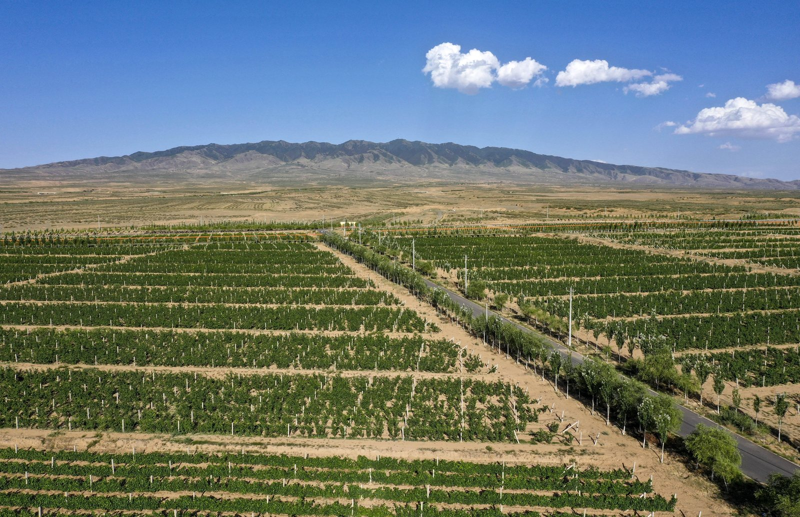
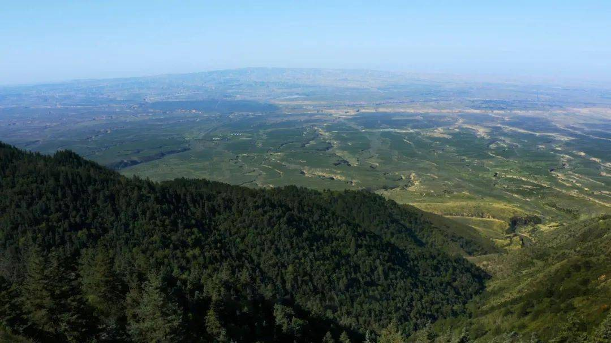
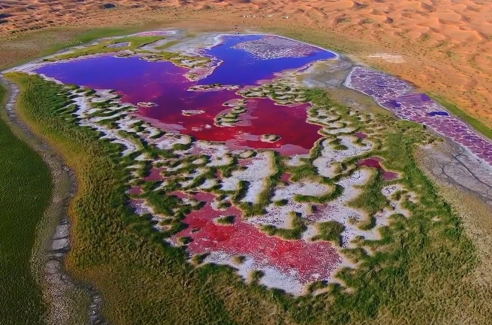
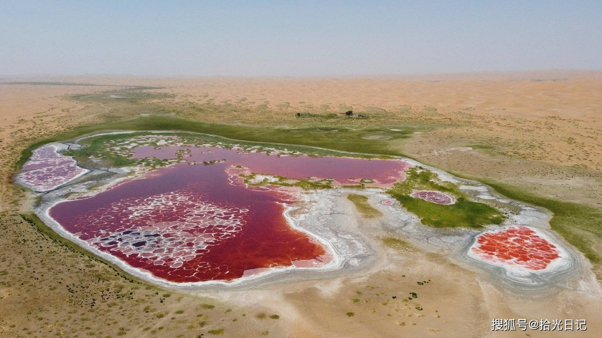
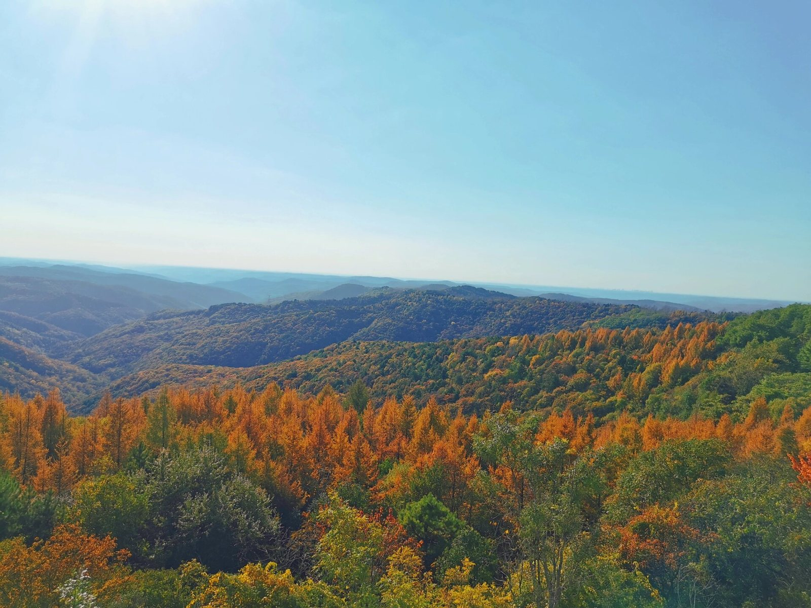
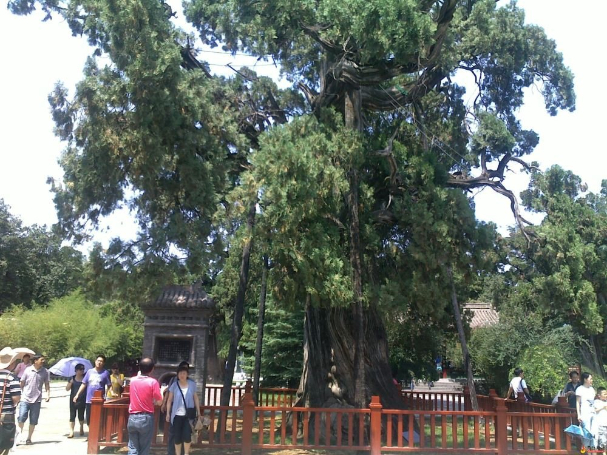

# 洛川出发 · 陕北 + 宁夏 自然景观自驾环线（5 天）

> **适用**：延安洛川县出发 / 自驾 / **10 月秋季**（其他季节需自行调整光线时段）/ 偏好纯自然景观
> **核心约束**：**不走回头路；单段车程尽量不超过 2.5 小时**
> **总里程**：约 **1660 km** / 5 天
> **最长单段**：**2.8 小时**（仅最后返程一段，其余全部 ≤2.4 h）

---

## 一、路线总览

```
             黄河 ─ 黄河        丹霞        荒漠湖泊        沙漠
              ▼     ▼            ▼            ▼            ▼
  洛川 ─1.6h─> 壶口 ─1.7h─> 乾坤湾 ─2.3h─> 波浪谷 ─2.4h─> 盐池·哈巴湖
   ▲          ┕─── D1 ───┙      ┕───────  D2  ───────┙      D2 宿
   │              宿延川        上午一线天 + 傍晚湖光          │1.7h
   │                                                          ▼
   │                                        红寺堡·罗山 ─1.1h─> 中卫
   │                                            D3↗            D3-D4
   │  2.8h        1.9h         1.4h                             │2.1h
   │            (最后一段)                                       ▼
   └─ 庆阳 <── 平凉·崆峒山 <── 固原 <────1.5h──── 海原·南华山
       D5         D5 晨          D4↘                D4
                              森林秋色         金色落叶松
```

**景观主线**：黄河的水与弯 → 丹霞的纹 → 荒漠的湖 → 沙漠的湖 → 山地的秋。五段景观类型互不重复，一路向西北推进再从南边折回，**全程不走回头路**。

| 日 | 主要景点 | 驾驶 |
|---|---|---|
| **D1** | 壶口瀑布（上午）+ 黄河乾坤湾（下午金光） | 3.3 h |
| **D2** | 靖边波浪谷（上午一线天）+ 盐池哈巴湖（傍晚） | 4.7 h |
| **D3** | 红寺堡罗山 + 沙坡头 + 中卫 66 号公路 | 2.8 h |
| **D4** | 腾格里沙漠五湖 + 海原南华山 | 3.6 h |
| **D5** | 崆峒山 + 子午岭，返程 | 6.1 h |

**两个排线要点**——照着走就行，细节在各日说明里：

- **行程是围着光线排的**，不是按距离排的。多数景点只在特定时段成立（波浪谷的一线天只在 10:00-12:00、乾坤湾非下午侧光不可），所以 **D1 和 D2 都需要早起**，其余各天都不赶。
- **长途都拆开了**，每个断点都落在一个值得停的地方（哈巴湖、罗山、南华山），不是服务区。除返程末段 2.8 h 外，单段车程都在 2.4 h 内。

---

## 二、逐日行程

### Day 1｜洛川 → 壶口瀑布（136 km / 1.6 h）→ 乾坤湾（141 km / 1.7 h）· 黄河双景

**今天要早起：7:00 出发。** 两个景点都是下午光线最好，同天走只能给一个——这天把最佳光线让给乾坤湾。

**时间表**

| 时段 | 安排 |
|---|---|
| 07:00 | 洛川出发 |
| 08:40-11:30 | **壶口瀑布**（约 3 小时，含龙洞） |
| 11:30-12:30 | 午餐（壶口镇） |
| 12:30-14:15 | 走**沿黄观光公路**北上，途中随时停车看河 |
| **15:00-17:00** | **乾坤湾**——大拐弯的黄金光线窗口 |

#### 上午：壶口瀑布


壶口是黄河唯一的大瀑布。宽阔河面在这里被骤然收进几十米石槽——看的不是落差，是**整条黄河被挤进一个壶口**的那股力量。

**让出下午光线不影响它**：壶口的看点是水量和气势，上午一样震撼；**水雾彩虹上午也有**，只要出太阳。


<sub>↑ 这不是等来的运气——9-11 月的壶口，阳光角度配上瀑布水雾，出彩虹是常态。</sub>

- **分陕西侧和山西侧，门票不通用**。从洛川来走**陕西侧**，视野开阔适合全景，**无需两岸往返**。
- **水雾极大**，必带雨衣或防水外套，穿防滑鞋；相机注意防水。
- 国庆旺季**建议提前 1-3 天公众号预约**，会限流。
- 别错过**龙洞**——从侧下方仰视瀑布的通道，视角和观瀑台完全不同。

#### 下午：黄河乾坤湾


黄河在这里拐出一个近 **320° 的大弯**，是整条黄河最著名的曲流。上午看的是黄河的"力"，下午看的是黄河的"形"——同一条河，两种完全不同的震撼。

**中间这段路本身就是风景**：走**沿黄观光公路**北上，一路贴着秦晋大峡谷，比高速慢但值得。


- **15:00-17:00 是拍大拐弯的最佳光线，这是今天早起的全部理由**。上午顶光下河湾发白、层次全无；只有下午侧光才能拉出沟壑的立体感。
- 景区范围大，**建议买观光车票**。时间够的话，**清水湾、会峰寨**也值得走。
- 观景台在崖边，**风大**，注意安全和帽子。

**住**：乾坤湾景区附近的窑洞民宿，或延川县城。住景区旁还能赶一次日出——晨雾里的河湾是另一种样子。

---

### Day 2｜乾坤湾 → 波浪谷（181 km / 2.3 h）→ 哈巴湖（194 km / 2.4 h）· 丹霞 + 荒漠湖

**今天两个景点都在傍晚最美，只能给一个。** 波浪谷让出日落、改看它上午的另一张牌——这样哈巴湖能拿到真正需要的傍晚光。

| 景点 | 今天安排的时段 | 为什么 |
|---|---|---|
| **波浪谷·地心丹霞** | **10:00-12:00** | 一线天在这个时段阳光从谷顶直射入底，**这正是它的最佳窗口** |
| **哈巴湖** | **15:30-18:00** | 湖光倒影和晚霞，非傍晚不可 |

**要早起：乾坤湾 7:30 出发。** 全程一路向西北推进，不走回头路。

**时间表**

| 时段 | 安排 |
|---|---|
| 07:30 | 乾坤湾出发 |
| 09:50-12:30 | **波浪谷**——地心丹霞一线天（最佳光线）+ 赤壁丹霞 |
| 12:30-13:00 | 午餐（龙洲镇或靖边） |
| 13:00-15:30 | 车行至哈巴湖 |
| **15:30-18:00** | **哈巴湖**——傍晚湖光 + 晚霞 |

#### 上午：靖边波浪谷（龙洲丹霞）


层层叠叠的红砂岩纹理如凝固的波浪，国内最好的红砂岩丹霞地貌。


**上午来正好赶上地心丹霞**：一线天需要阳光从狭窄谷顶垂直射入谷底，**10:00-12:00 是它一天中唯一的窗口**，光影对比最强。这跟傍晚的火焰丹霞是两个不同片区、两种不同的美——今天取前者。

**要点**
- 门票约 90 元（淡季可能降至 60 元）；**区间车约 30 元且必乘**——三个片区彼此很远，走不过去。
- 优先**地心丹霞（一线天）**，时间够再加**赤壁丹霞**。火焰丹霞是日落景，今天不强求。
- **穿浅色衣服**（白、黄、蓝）；红衣服会融进红岩背景。
- **别信路边"免费野波浪谷"的带路**。很多是封闭保护区，有安全隐患，也可能被劝返，走正规入口。
- 丹霞岩层脆弱，务必走栈道；砂岩路面，防滑鞋。

#### 傍晚：盐池 · 哈巴湖国家级自然保护区


沙漠治理后形成的**湿地湖泊 + 沙丘 + 人工林**共生地貌。看点不是湖有多大，而是**"沙海绿洲"的强烈对比**——连绵沙丘紧挨着郁郁葱葱的林木和水面。


**要点**
- 门票约 **50 元/人**；自驾进入约 300 元/车（含门票及露营位）。景区面积很大、景点分散，**自驾是唯一实际的游览方式**。
- **15:30 到，正好覆盖傍晚黄金光**——湖光倒影和晚霞最好的时段。正午强光最差，别中午来。
- 秋季景区内**胡杨林会变黄**。
- 晚餐吃**盐池滩羊**，这是宁夏最有名的羊肉产地。

**住**：盐池县城。喜欢露营和星空的话，景区内有房车营地、木屋和帐篷，夜晚观星条件好。

> **想更松、或更想看火焰丹霞日落**：把这天拆成两天——先到波浪谷走完整大环线、等 18:00 日落，宿龙洲镇；次日再去哈巴湖（2.2 h，傍晚到）。两个景点都能拿最佳光线，每天只开 2.2-2.3 h，总程变 6 天。

---

### Day 3｜盐池 → 红寺堡（146 km / 1.7 h）→ 中卫（91 km / 1.1 h）· 下午沙坡头

今天路程轻松，中途在红寺堡的罗山停一次，把去中卫的路切成 1.7 + 1.1 h 两段。

#### 中途停点：红寺堡 · 罗山



罗山是宁夏中部干旱带上一座孤立的绿色山体，被称为"荒漠中的绿岛"。山下是大片酿酒葡萄园，**10 月正是葡萄采收季**。



停留 1-1.5 小时，午餐加走动即可。

#### 下午：沙坡头


沙坡头的独特不在"沙漠"本身，而在**腾格里沙漠边缘和黄河直接撞在一起**——一侧连绵沙丘，一侧绿洲河水，这种反差国内几乎找不到第二处。


**要点**
- 分**沙漠区**和**黄河区**两侧，都要走到才算看全。
- **门票只含首道大门**；滑沙、骆驼、黄河飞索、羊皮筏子等另收，按兴趣挑套票更划算。
- 国庆**必须提前预约**，会限流。
- **傍晚不要留在景区**：开车去 **中卫 66 号公路**（免费，全天开放），赶日落前半小时。


这条通往北长滩的乡村公路，起伏地势配两侧荒凉戈壁，是公路片的经典机位。**拍照请停观景台**——路窄，别站在路中间。

**住**：中卫市区。想要体验可选黄河宿集或沙漠营地，但**国庆需提前 45 天订**。

---

### Day 4｜腾格里沙漠半日 → 海原南华山（168 km / 2.1 h）→ 固原（115 km / 1.5 h）



**上午：腾格里沙漠腹地越野（半日团）**

**为什么不自驾进沙漠**：腹地没有路，陷车、迷路、无信号都是真实风险。四驱越野加当地司导是唯一稳妥方式，**切勿自行驾车进入沙漠腹地**。

"五湖穿越"一次串起腹地多个沙漠湖泊：

| 湖 | 看点 |
|---|---|
| **乌兰湖** | 湖水呈酒红色，俗称"地球之心"；**6-10 月颜色最浓** |
| **天鹅湖** | 芦苇丛生，沙漠里的水鸟栖息地 |
| **骆驼湖** | 粉色湖面，与黄沙强反差 |



- **选上午出发的半日团**（约 4 小时），中午前结束，下午才有时间转场。想玩整天则需在中卫多住一晚。
- 参考价：拼车约 300-600 元/人；包车约 1500-4000 元/车（坐 4 人）。
- **乌兰湖的酒红色只有俯视才成立**——需无人机，或选**含司导航拍**的行程。
- 订前确认：是否含市区接送、航拍、**保险**。
- **冲沙颠簸剧烈**，心脏病、颈椎病患者及孕妇不建议参加。

#### 中途停点：海原 · 南华山（这一段的关键）


南华山是六盘山余脉，海拔较高、植被丰富。**10 月这里层林尽染，落叶松金黄**，是全程第一处森林景观，和前三天的干旱地貌形成最大反差。


**要点**
- 有环山步道，轻徒步和深度徒步线路都有。**停 1.5-2 小时**走一段即可。
- **山上没有餐饮设施**，需自备水和干粮。
- 山顶气温比县城低，**秋季早晚温差大**，冲锋衣必带。
- 顺路可看海原大地震博物馆（1920 年海原大地震遗迹）。
- 晚餐吃海原羊羔肉、燕面揉揉、荞面搅团。

**住**：固原市区。

---

### Day 5｜固原 → 崆峒山（79 km / 1.4 h）→ 庆阳（160 km / 1.9 h）→ 洛川（249 km / 2.8 h）

**返程不原路退回**，改走甘肃，顺路捡下全程最后一个大景。

#### 上午：平凉 · 崆峒山


**10 月是崆峒山一年中最美的时候**。丹霞地貌的岩壁配上变色的辽东栎和枫树，浅红、绯红、深红交织；**秋季雨后常出云海**，古刹飞檐在云雾中若隐若现。


**要点**
- 旺季门票（4/1-10/31）约 **110 元/人**；景区环保车、索道另收。
- **善用环保车和索道**：坐车到中台，再步行游核心区（中台、皇城），既省力又不错过精华。半天足够。
- 山势较高，10 月早晚气温低，**带保暖外套**；穿登山鞋。

#### 中午：庆阳（午餐 + 休息，1.9 h 车程）

从崆峒山下来后西行至庆阳吃午饭、休整。

#### 下午：庆阳 → 洛川（249 km / 2.8 h）· 全程唯一超标段

**这是全程唯一一段超过 2.5 h 的路。**



**中途务必在正宁的子午岭林区停一次**（约 104 km 处，正好过半）。子午岭是黄土高原上难得的大片天然次生林，**秦直道**（世界上最早的"高速公路"）遗址就穿行在林脊上——路面笔直、两侧树木夹峙，纵深感极强。

停 30-40 分钟，走一段林道、活动一下再上路。这样 2.8 h 被拆成两个 1.4 h 的驾驶段，实际不累。

**时间建议**

| 时段 | 安排 |
|---|---|
| 07:30-12:00 | 崆峒山（含索道，赶早人少、云海概率高） |
| 12:00-14:00 | 车行至庆阳，午餐休整 |
| 14:00-15:30 | 庆阳 → 正宁 |
| 15:30-16:10 | 子午岭林区活动腿脚 |
| 16:10-17:40 | 正宁 → 洛川，到家 |

> **想更松的话**：在正宁或庆阳住一晚、次日上午再回洛川，就能把这段拆成 1.3 + 2.2 h 两段，全程零超标——代价是多一天。

#### 到家后的加码（若还有精神）



**黄帝陵（桥山）** 距洛川仅 39 km / 0.5 h。桥山上有数万株古柏，其中"黄帝手植柏"树龄约五千年，被称为"世界柏树之父"。纯看树也值得——那种苍劲的生命力是别处没有的。

---

## 三、车程总表

| 日 | 路段 | 里程 | 车程 |
|---|---|---|---|
| **D1** | 洛川 → 壶口瀑布 | 136 km | **1.6 h** |
| **D1** | 壶口 → 黄河乾坤湾 | 141 km | **1.7 h** |
| **D2** | 乾坤湾 → 靖边波浪谷 | 181 km | **2.3 h** |
| **D2** | 波浪谷 → 盐池（哈巴湖） | 194 km | **2.4 h** |
| **D3** | 盐池 → 红寺堡（罗山） | 146 km | **1.7 h** |
| **D3** | 红寺堡 → 中卫 | 91 km | **1.1 h** |
| **D4** | 中卫 → 海原（南华山） | 168 km | **2.1 h** |
| **D4** | 南华山 → 固原 | 115 km | **1.5 h** |
| **D5** | 固原 → 崆峒山 | 79 km | **1.4 h** |
| **D5** | 崆峒山/平凉 → 庆阳 | 160 km | **1.9 h** |
| **D5** | 庆阳 → 洛川（**中途停子午岭**） | 249 km | **2.8 h** ⚠ |
| | **合计** | **约 1660 km** | **除末段外最长 2.4 h** |

**单日驾驶总时长**（压缩后前段不再稀松）

| 日 | 驾驶合计 | 主要景点 |
|---|---|---|
| D1 | 3.3 h | 壶口瀑布 + 乾坤湾 |
| D2 | 4.7 h | 波浪谷一线天 + 哈巴湖傍晚 |
| D3 | 2.8 h | 罗山 + 沙坡头 + 66 号公路 |
| D4 | 3.6 h | 腾格里沙漠 + 南华山 |
| D5 | 6.1 h | 崆峒山 + 子午岭（返程日） |

**参考里程（对比与备选）**

| 路段 | 里程 | 车程 |
|---|---|---|
| *乾坤湾 → 中卫（不拆，直穿）* | *560 km* | *6.6 h* |
| *甘泉大峡谷 → 中卫（若保留甘泉）* | *515 km* | *5.9 h* |
| *中卫 → 固原（不拆）* | *223 km* | *2.7 h* |
| *固原 → 洛川（不拆）* | *429 km* | *5.0 h* |
| *庆阳 → 洛川（不停正宁）* | *249 km* | *2.8 h* |
| 洛川 → 黄帝陵 | 39 km | 0.5 h |
| 洛川 → 延安市区 | 110 km | 1.3 h |

---

## 四、行前清单

**必须提前订/约**

| 事项 | 提前多久 |
|---|---|
| 中卫住宿（尤其沙漠营地 / 黄河宿集） | **45 天** |
| 腾格里沙漠越野（**订上午半日团**） | 一周以上，确认含接送/航拍/保险 |
| 沙坡头门票预约 | 出发前几天，国庆限流 |
| 壶口瀑布预约 | 提前 1-3 天 |
| 延川（乾坤湾）、盐池、固原住宿 | 一周以上（小城房源少） |

**装备**
- **保暖**：D2 荒漠日落后骤冷、D4 南华山山顶、D5 崆峒山早晚——厚外套或冲锋衣必备，这条线秋季温差是主要挑战。
- **防水**：D1 壶口水雾极大，雨衣或防水外套 + 相机防护。
- **干粮和水**：**南华山山上没有餐饮设施**，务必自备。
- **防晒**：西北 10 月紫外线仍强，高倍防晒霜、墨镜、宽檐帽。
- **防沙**：魔术头巾、防沙鞋套（景区买贵，提前网购）。
- **鞋**：防滑运动鞋/登山鞋——壶口湿滑、峡谷湿滑、崆峒山要登山，全程都需要。
- **穿搭**：浅色系（白/黄/蓝）在红砂岩和黄沙里最出片。
- **无人机**（如有）：乌兰湖的"地球之心"只有航拍才成立。

**自驾注意**
- **除返程末段外，每段都在 2.1 h 内，中间都有落脚点。**
- **三个硬时间点**：D1 早 7:00 出发（为乾坤湾下午的光）、**D2 早 7:30 出发**（为波浪谷 10-12 点的一线天，之后还要赶哈巴湖傍晚）、D5 早 7:30 上崆峒山（当天要开 6.1 h 回家）。其余都不用赶。
- **返程日（D5）驾驶 6.1 h 是全程最重的一天**，务必在子午岭停一次把 2.8 h 那段拆开；若当天状态不好，就在正宁或庆阳住一晚。
- **经过靖边、盐池等县城时把油加满**——西北长距离荒漠路段服务区油品供应有时不稳。
- 南华山、崆峒山、子午岭均为山区路，弯道多；**10 月山区可能大雾**，出发前看天气。
- 沙漠腹地手机信号不稳，行程提前规划好。
- **天气**：这条线对天气不敏感。波浪谷是露天丹霞，**雨后岩石颜色反而更浓**；哈巴湖阴天少个晚霞但湿地照样看。唯一要防的是山区大雾（南华山、崆峒山）。

<sub>**数据说明**：里程与车程由 OSRM 路径规划实测（点到点路网距离），不含景区内部游览与绕行；实际请以出行当日高德/百度实时路况为准。门票与价格为近期搜索所得参考值，可能变动，务必以景区官方公告为准。图片取自网络公开图源（百度、B站、携程、去哪儿、搜狐、央视等），仅作行程示意，版权归原作者所有。</sub>
